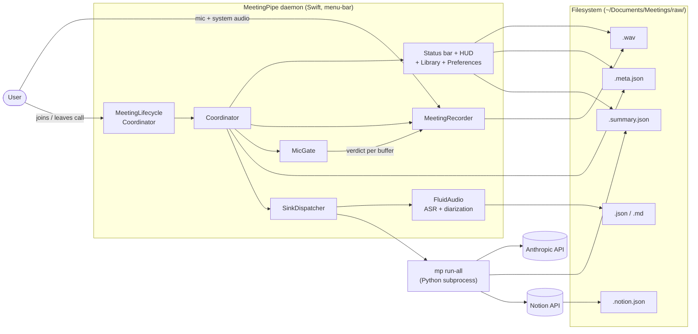
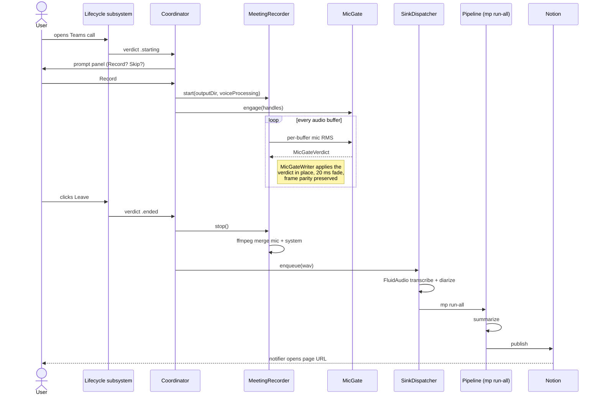
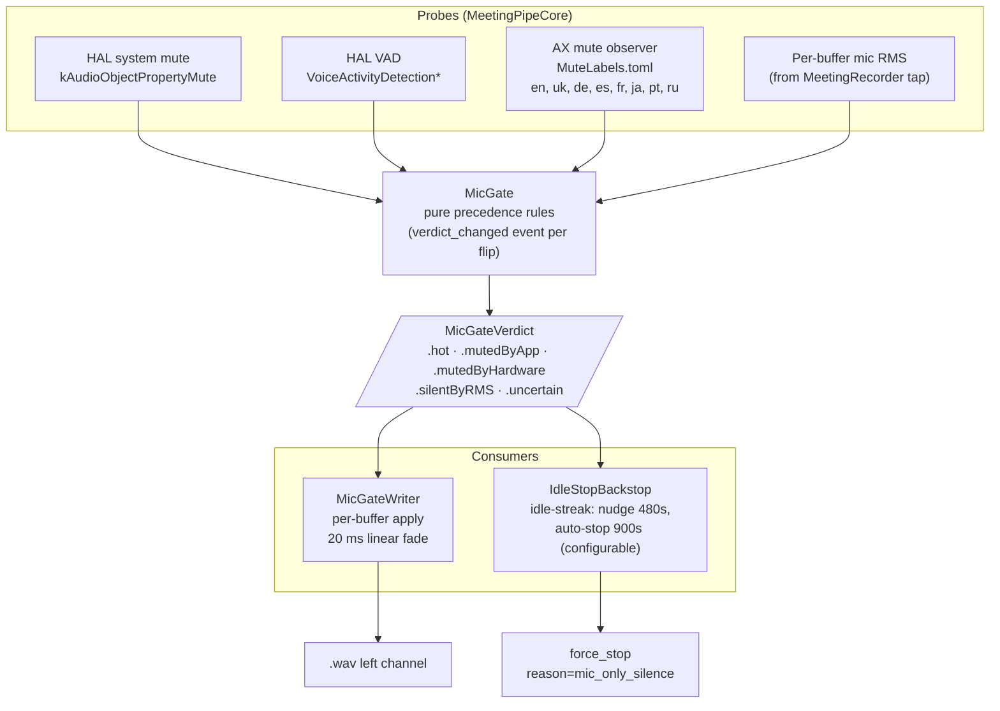
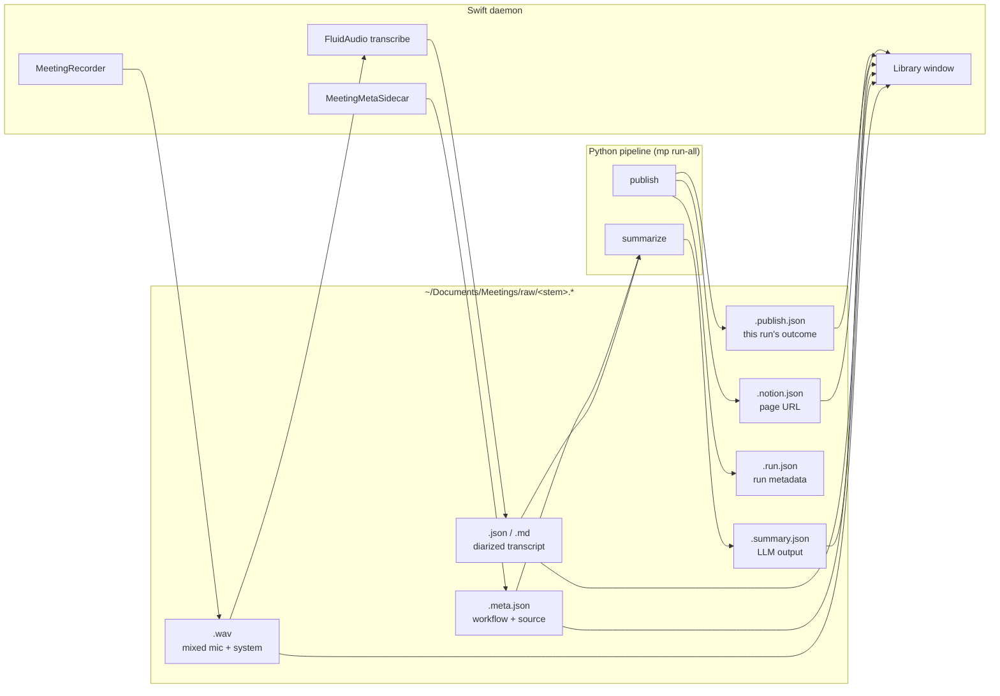

# Architecture

Fast subsystem map for finding code. For the *why* behind shape decisions, see the README ["Why it is shaped this way"](./README.md#why-it-is-shaped-this-way) and the [ADRs](./docs/decisions/). For terminology, see the [Glossary](#glossary) below. For coding patterns, see [`CONVENTIONS.md`](./CONVENTIONS.md).

```
meeting-pipe/
├── daemon/      Swift menu-bar app (detection, recording, transcription, UI, hotkeys)
├── pipeline/    Python CLI invoked as `mp <subcommand>` (summarize, publish)
└── scripts/    install.sh, rebuild.sh, uninstall.sh, dev tools
```

The daemon records the WAV, writes the `.meta.json` sidecar, and transcribes on-device (FluidAudio); then it spawns the pipeline as a subprocess and forgets about it. The pipeline reads the transcript and the sidecar, decides what to do per workflow, and summarizes / publishes. The two processes share contracts via files on disk: `.meta.json` (per recording) and `events.jsonl` / `pipeline_events.jsonl` (append-only logs).

---

## Visual overview

Five diagrams for the high-level picture. Each answers one question; jump to the section that matches what you need.

### Subsystem map

Who-talks-to-whom across the whole system. The daemon is one Swift process that owns detection, recording, and routing; the pipeline is a short-lived Python subprocess invoked per meeting.



### Meeting lifecycle

What happens between "you join a Teams call" and "the Notion page appears". MicGate runs in parallel with the recorder for the whole call; the pipeline subprocess runs after the recorder closes the WAV.



### Verdict-fusion stack

The post-detection layer that decides, every audio buffer, whether your mic should be audible or silent. Four probes feed `MicGate`; its verdict drives both the writer (shapes the recorded audio) and the silence backstop (auto-stops dead meetings).



`MeetingLifecycleCoordinator` is the sibling system for meeting-level verdicts (`.idle`, `.starting`, `.inMeeting`, `.endingProvisional`, `.ended`). It runs alongside MicGate; its `.ended` verdict drives stop-recording (TECH-C13 step 5, shipped).

### Data contracts

The daemon and pipeline share state through files on disk, not IPC. Six sidecars per meeting; the schemas live in [`CONVENTIONS.md`](./CONVENTIONS.md). The library window also reads the same files.



### Workflow resolution

How a recording gets routed: precedence top-down. The prompt window's chevron menu sets an explicit override; failing that, rules match by bundle ID and window title; failing that, the default workflow runs. `nda_mode` then forces local backend + filesystem-only sinks regardless of the resolved workflow's preferences.


---

## Daemon — `daemon/Sources/MeetingPipe/`

### Lifecycle entry points

- `App.swift` — `@main`. NSApplication accessory app. Reads `UISettings`, applies theme, sets up `ConfigStore` + `SecretsStore`, constructs `Coordinator`, wires `StatusBarController`, kicks off `SystemAudioCapture.prewarm`.
- `Coordinator.swift` - the spine (633 lines, plus the `Coordinator+Session` / `+Delegates` / `+MenuActions` extensions). Constructs and owns every subsystem and routes between them. The place where everything meets.
- `MeetingSessionController.swift` - one meeting's lifetime, lifted out of the Coordinator by TECH-ARCH2 (915 lines): the two verdict-consumer Tasks, the recording begin/stop path, the prompt timeout, the MicGate and lifecycle engage/disengage, and meta-sidecar writing. It reaches its host through `unowned let coordinator: any SessionHost` (ARCH4), not through `Coordinator` itself, so `MeetingSessionControllerBranchTests` drives the real controller against `FakeSessionHost`.
- `SessionHost.swift` - the seam the session controller sees: every member it reads through `coordinator.`, and nothing else. The six UI / I/O collaborators (status bar, notifier, recorder, HUD, prompt window, job dispatcher) are protocol-typed because a test cannot have the real ones; everything else stays concrete because a test can already build it. `micAuthorizationStatus` lives here too, so the permission-denied branch is reachable without TCC. `Coordinator+SessionHost.swift` is the production conformance.

The four collaborators the spine delegates to, in `Coordination/`:

- `DetectionStateMachine.swift` - the recording-side state machine (`.idle`, `.prompting` / `.suppressed`, `.recording`, `.stopping`) and the `RepromptCooldown` facade. Main queue only.
- `SinkDispatcher.swift` - the post-recording queue: FluidAudio transcription, then `mp run-all`, serially. Owns the failure-sidecar stage attribution.
- `PipelineJobDispatcher.swift` - routes job completion to the user-facing surfaces (done notification, error banner, queue-depth badge). Side effects injected as closures.
- `ConfigRefreshCoordinator.swift` - the daemon's response to configuration changes (eager reload, model pre-fetch on a backend flip).

### Detection - "is the user in a meeting?"

Detection is the `MeetingPipeCore` lifecycle subsystem plus the daemon-side discovery scan.

- `MeetingPipeCore/Lifecycle/MeetingLifecycleCoordinator.swift` - owns the per-app adapters and fuses their signals into a `MeetingLifecycleVerdict` stream (`.idle`, `.starting`, `.inMeeting`, `.endingProvisional`, `.ended`).
- `MeetingPipeCore/Lifecycle/PromotionEngine.swift` - the pure verdict-fusion rules: a debounce that promotes provisional signals to a confirmed verdict.
- `MeetingPipeCore/Lifecycle/Signals/` - the signal sources: per-process audio activity, ScreenCaptureKit shareable-content windows, the AX Leave button, plus corroborating window-title / workspace / input-device signals.
- `MeetingPipeCore/Lifecycle/Adapters/` - one adapter per meeting client (Teams, Zoom, Webex, Slack, browser), wiring the right signals with locale-tolerant title patterns.
- `MeetingDiscoveryWatcher.swift` / `MeetingSourceScanner.swift` / `MeetingSourceScorer.swift` - start-side discovery: enumerate every concurrent candidate app, score each on "I am in a meeting" evidence, pick the strongest.
- `Resources/meeting_apps.toml` - per-bundle-id table of known meeting apps and their window-title regex hints.
- `MeetingPipeCore/MicGate/IdleStopBackstop.swift` - meeting-idle backstop (TECH-END3): the "Still meeting?" nudge (default 480s) and the forgotten-recording auto-stop (default 900s). Detailed under Mute gating below.
- `RepromptCooldown.swift` - per-bundle, fixed-duration suppression window after a recording / skip so a post-call mic flicker can't spawn a fresh prompt.
- `SkippedMeetingLatch.swift` - per-bundle suppression anchored to discovery liveness (not a fixed clock): once you dismiss a prompt, every discovery sighting of that app refreshes the latch, so the meeting stays skipped for its whole lifetime and lapses ~15 s after it ends. Paired with `RepromptCooldown` in `abandonPrompt`.

### Recording - "capture what's playing + what I say"

- `MeetingRecorder.swift` - AVAudioEngine for mic capture + the `SystemAudioCapture` source for everything else, mixed and written to disk. `MicGateWriter` applies the per-buffer mute verdict in place. At start it resolves the bound input device (`MeetingPipeCore/Infra/InputDeviceIdentity`) and snapshots whole-recording mic coverage; `MeetingSessionController` reads both at stop to persist which mic was used (`mic_device_name`) and to fire the dead-mic warning (`MicCoverageWarning`, the mirror of `RemoteAudioWarning`) when the mic stayed silent under a live system channel (MIC15).
- `SystemAudioCapture.swift` - ScreenCaptureKit + ProcessTap (macOS 14.2+) capture of every-other-process audio. The `excludesCurrentProcessAudio` API is the macOS 14 hard floor.

### Mute gating - "don't record me while I'm muted"

- `MeetingPipeCore/MicGate/` - the `MicGate` verdict-fusion subsystem. Probes (HAL system mute, HAL voice-activity detection, an AX read of the meeting client's Mute button, a per-buffer RMS gate) feed `MicGate.decide`; `MicGateWriter` zeros the mic channel with a short fade while muted, preserving frame alignment with system audio.
- `MeetingPipeCore/MicGate/IdleStopBackstop.swift` - the meeting-idle backstop (TECH-END3). Off one idle streak, gated on the fused `MicGate` verdict plus a live-system-audio mirror (not raw RMS, so ambient noise cannot keep a dead meeting open), it fires the nudge then the auto-stop. Supersedes the old `SilenceDetector` and `MicOnlySilenceBackstop`.

### Transcription - "ASR + speaker labels, on device"

- `Transcription/FluidAudioRunner.swift` - FluidAudio (Parakeet TDT for ASR, pyannote-community-1 for diarization) on the Apple Neural Engine. `SinkDispatcher` runs it after the recorder closes the WAV, producing `<stem>.json` / `<stem>.md`.
- `Transcription/SegmentBuilder.swift`, `TranscriptionRunner.swift`, `TranscriptionService.swift` - segment assembly, the runner protocol, and the factory the dispatcher calls.

### Workflows — per-context routing (TECH-B)

- `Workflow.swift` — the codable struct (matching rules, sinks, backend, NDA flag).
- `WorkflowStore.swift` — TOML CRUD against `~/.config/meeting-pipe/workflows/*.toml`. One file per workflow, atomic writes.
- `WorkflowMatcher.swift` — given an `AppSource`, picks the matching workflow. Precedence: explicit override > bundle id > window title regex > default.
- `WorkflowMigrator.swift` — first-run shim that seeds a "General" workflow from the legacy `summarization.team_context` field.
- `WorkflowInspector.swift` — the prompt-window chip + drop-down that lets the user override before recording.
- `WorkflowsView.swift` — the Workflows tab UI (list, reorder, inline editor, sink picker).
- `MeetingMetaSidecar.swift` — builder for `<stem>.meta.json`. The contract surface between Swift and Python — the pipeline reads exactly these keys via `mp.workflow.apply_overrides`.

### UI surfaces

- **Menu bar:** `StatusBarController.swift` — title, icons (outline/filled per `UISettings.menuBarIconStyle`), lock glyph for regulated mode, model-download progress, aggregate permission warning.
- **Prompt panel:** `MeetingPromptWindow.swift` — the top-right "Record / Skip / Record (BYO)" panel that pops on detection.
- **HUD:** `RecordingHUDWindow.swift` — the floating pulse while recording.
- **Library window:** `LibraryWindow.swift` + `LibrarySidebar.swift` + `LibraryListView.swift` + `MeetingDetailView.swift` + tabs (`TranscriptTab`, `AudioTab`, `CorrectionsTab`, `RawFilesTab`). Reads `~/Documents/Meetings/raw/*.meta.json` via `MeetingStore.swift`. Filter / search via `MeetingFilter.swift`. The INSIGHTS rail group hosts the cross-library projection views: `FactsView` (DV1), `AskView` (AI3), and `DigestsView` (AI4, the weekly digests in the `digests` sibling).
- **Preferences:** `PreferencesWindow.swift` (NSWindow shell) + `Preferences/PreferencesView.swift` (SwiftUI NavigationSplitView) + `Preferences/PreferencesControls.swift` (shared primitives: `SettingsGroup`, `SettingsRow`, `SettingsSegmented`, `SettingsHotkeyField`, …).
- **Correction window:** `CorrectionWindow.swift` + `CorrectionEditor.swift` — inline edit of a generated summary, writes a correction record, optional republish.
- **Diagnostics window (UX20):** `DiagnosticsWindow.swift` + `DiagnosticsView.swift` + `DiagnosticsLog.swift`, a read-only viewer over `events.jsonl` / `pipeline_events.jsonl` with since/category/action filters (the `mp logs` semantics, reading across PERF7's rotated generations), opened from the status-bar menu. Separately, the Preferences doctor sheet folds the daemon's own `DoctorCommand` probes (AX trust, TCC, per-app reachability, events-writable, orphan scan; `DoctorCommand.daemonSelfCheckProbes`) in front of the spawned `mp doctor`, so the argv-only probes are reachable in-app.

### Storage / persistence

- `Config.swift` — read-only Config snapshot loaded at launch (`~/.config/meeting-pipe/config.toml`).
- `ConfigStore.swift` — `ObservableObject` wrapper for the same file. Round-trips through TOMLKit, preserves unknown keys (so pipeline-side fields like `transcription.model` survive UI edits). 500 ms debounced writes.
- `Preferences/UISettings.swift` — singleton over `UserDefaults` for cosmetic flags (theme, menu-bar icon style, regulated badge, verbose logging).
- `SecretsStore.swift` + `KeychainSecrets.swift`: Anthropic + Notion tokens in the macOS login Keychain via `/usr/bin/security` (SEC8), not a plaintext file. Migrates a legacy `secrets.env` on first launch, then deletes it.
- `ConsentStore.swift` — per-bundle "always record this app" decisions.
- `CorrectionStore.swift` — `<stem>.correction.json` records so the user's edits feed back into evals.
- `SpeakerLabelStore.swift` — `<stem>.speaker_labels.json`, the reversible speaker-label overlay (FEAT3-UNDO / FEAT3-SEGMENT). In-app naming enrolls the voiceprint but records the name here instead of rewriting `<stem>.json`, resolved at display time in `TranscriptLoader.load`; undo/reset drops the entry. `labels` name a cluster; `segments` reassign a single segment (rides on `SegmentSelection.swift`, the pure Cmd/Shift-click multi-select model). Read back by `mp.speaker_overlay` on a regenerate. Parallels the text-correction overlay `TranscriptCorrectionStore`.
- `MeetingStore.swift` — read-only catalog of `<stem>.meta.json` sidecars; powers the Library list. Watches the directory via `DispatchSource.makeFileSystemObjectSource`.

### Plumbing

- `PipelineLauncher.swift` — spawns `mp run-all <wav>` as a subprocess. Each job is one `ProcessingJob` (see `State.swift`); the queue runs them serially so two whisper invocations don't thrash the GPU.
- `LocalServerReaper.swift` — kills an `mlx_lm.server` that outlived the `mp` which spawned it (LOCAL10). The server setsid's into its own session, so a watchdog SIGKILL of `mp` leaves it resident; Python's `mlx-server.json` marker names it. Reaps at launch (from `Coordinator.reapStorage()`) and right after the watchdog kills a job.
- `PermissionsCenter.swift` — single source of truth for the four TCC permissions (mic, Screen Recording, Accessibility, Notifications). Polls for live-flip detection; publishes a `permissionGranted` PassthroughSubject the Coordinator listens to (so the detector wakes up the moment Accessibility flips on mid-meeting).
- `HotkeyManager.swift` — Carbon RegisterEventHotKey for global hotkeys (toggle + force-stop + flag-moment + off-the-record).
- `Automation/` (AUTO1) — the `meetingpipe://` URL scheme, the external-trigger sibling of the hotkeys. `AutomationCommand` is the pure, unit-tested parser (`meetingpipe://toggle|record|stop|library|ask|digest`); `AppDelegate.application(_:open:)` receives the deeplink and `Coordinator+Automation.handleAutomation` routes it through the same session entry points the hotkey uses (so mic-denied still deeplinks to Permissions). Shortcuts (via "Open URL"), Raycast, and Stream Deck drive it with no App Intents metadata. The `CFBundleURLTypes` registration lives in `scripts/install.sh`'s Info.plist heredoc, so it needs one `install.sh` run (not just `rebuild.sh`) to take effect.
- `Notifier.swift` — UNUserNotificationCenter wrapper (record / skip prompts, "meeting published" alerts).
- `Logger.swift` — `Log.main / .detector / .recorder` os.Logger handles, plus `Log.event(category:action:attributes:)` for the JSONL event log and `Log.writeLine(category:message:)` for the human-readable tail files.
- `ModelDownloadSupervisor.swift` — spawns `mp prefetch-model` for local-backend MLX models; surfaces progress in the menu bar.
- `WindowActivationManager.swift` — keeps the daemon Dock-less when no windows are visible but flips activation policy to `.regular` when the Library or Preferences window is open so Cmd+Tab works.
- `LaunchAtLoginService.swift` — `SMAppService.mainApp` wrapper for the General-tab toggle.
- `DigestSchedulerService.swift` — AI4: writes `~/Library/LaunchAgents/com.meetingpipe.digest.plist` (a `StartCalendarInterval` running `mp digest`) and `launchctl bootstrap`/`bootout`s it, driven by the Preferences → Pipeline digest toggle. Schedule state lives in `UISettings`.

---

## Pipeline — `pipeline/src/mp/`

### Entry point

- `__main__.py` - argv dispatch. Lazy imports per subcommand so `mp --help` and `mp logs` stay fast; the heavier `mlx_lm` / `soundfile` imports are deferred to the subcommands that use them.

### Subcommands (one module each)

One module per subcommand, registered in `__main__.py`. **Adding a subcommand means adding a row here in the same commit.**

| Module | Subcommand | Output |
|---|---|---|
| `orchestrate.py` | `mp run-all <wav>` | reads the daemon transcript, then summarize, then publish; fail-fast |
| `summarize.py` | `mp summarize <transcript.md> [--backend <b>]` | `<stem>.summary.json`, `<stem>.summary.md`; `--backend` re-summarizes on a one-shot engine (PIPE6), regulated/NDA still force local |
| `summarize_local.py` | `mp serve-local`, and called from `summarize` | on-device MLX path; also the warm `mlx_lm.server` the daemon can pre-launch |
| `publish_cmd.py` | `mp publish <summary.json>` | fan an existing summary out to all sinks (the Apple Intelligence hand-off) |
| `publish_notion.py` | `mp publish-notion <summary.json>` | Notion page (idempotent) |
| `publish_from_paste.py` | `mp publish-from-paste <transcript.md>` | BYO summary, then publish |
| `diarize_cleanup.py` | `mp cleanup-diarization <transcript.json>` | LLM pass merging same-speaker labels (TECH-DIAR1) |
| `ask.py` | `mp ask <question>` | engine-backed, cited answer over the library (AI3) |
| `digest.py` | `mp digest` | weekly review digest, on-device (AI4) |
| `actions.py` | `mp actions` | open action items across the library (TECH-FEAT4 + AI1) |
| `roster_cmd.py` | `mp roster {enroll,list,forget,rename}` | named-speaker voiceprint management (FEAT3-ROSTER; `rename` is FEAT3-MANAGE) |
| `backup.py` | `mp backup <dir>` | dated tar.gz of the non-recreatable state + manifest (STOR2) |
| `restore.py` | `mp restore <archive>` | unpack a backup into this Mac's configured roots (STOR2) |
| `doctor.py` | `mp doctor` | preflight diagnostics |
| `logs_cmd.py` | `mp logs` | `events.jsonl` pretty-printer / filter |
| `prefetch_model.py` | `mp prefetch-model <repo>` | MLX model download (JSONL progress) |
| `corrections.py` | `mp corrections-stats` | aggregate over correction records |
| `train_adapter.py` | `mp train-adapter` | fine-tune a local LoRA adapter on the corrections corpus (LOCAL9, on-device) |
| `analyze_detection.py` | `mp analyze-detection` | meeting-end detection audit |
| `classify.py` | `mp classify-meetings` | AI5 spike: heuristic (+ optional local-LLM) meeting-type labels over the library |
| `dogfood.py` | `mp dogfood` | side-by-side backend comparison (Anthropic vs local, or `--adapter` for base vs LoRA) |

### Sinks

- `publish_router.py` - the fan-out over `effective_sinks(cfg)`. Runs each publisher, isolates their failures, and writes `<stem>.publish.json` with this run's outcome. Owns the `EXIT_PUBLISH_FAILED` contract (PIPE1).
- `publish_obsidian.py` - Markdown note in the vault. `publish_fs.py` - three files in a directory. `publish_lan.py` - the same three files onto a mounted SMB/NFS share, atomically and behind a reachability check (TECH-FEAT1). `publish_notion.py` doubles as the `NotionRestPublisher` used by the router.

### AI band (engine-backed, on-device by default)

- `engine.py` - free-form text completion honouring `effective_backend()`. Every AI feature routes through it, so the egress clamp has one place to bite.
- `backend_fallback.py` - the one implementation of the `auto` ladder: try Anthropic, drop to local when the cloud is unreachable or unwilling (connection, timeout, auth, 429, 5xx), let a caller bug propagate. Shared by `engine.complete_text` and `summarize._AutoFallbackClient` (PIPE7). It never decides *whether* cloud is allowed; `config.effective_backend` already did.
- `provider_claude_cli.py` / `provider_openai.py` - the two PROV1 backends beside `anthropic` / `local`. Each is one module implementing both seam shapes (`SummaryClient.summarize` + `TextClient.complete`), dispatched from `summarize._select_backend` and `engine.complete_text`. `claude_cli` spawns headless `claude -p` (no API key, cloud, fail-closed via `config.CLI_BACKENDS` + a spawn-time armed-guard refusal); `openai` is raw httpx so the egress guard clamps it like anthropic. `json_extract.largest_balanced_json_object` is the shared balanced-JSON scan both providers and `summarize_local` use to recover a schema object from messy text.
- `summary_language.py` - the shared post-hoc language verifier (LANG1, generalizing LOCAL7): a cheap pure script detector plus a per-section divergence check (`divergent_sections`, including `actions[].task`). `summarize.summarize` runs it backend-agnostically after any client answers, so a cloud summary whose sections drift into an unexpected language is repaired once; `summarize_local` shares the same detector for its in-client replay.
- `embed_index.py` - the on-device embedding index over the library. `rag.py` - durable retrieval assembly for cited answers. Both back `ask.py` and `digest.py`.
- `chunking.py` - the transcript chunking primitive. `prompt_safety.py` - wraps transcript text as untrusted data, not instructions (TECH-SEC6).

### Per-meeting data

- `workflow.py` - applies the `<stem>.meta.json` overrides onto the config. `workflows.py` - reads the workflow TOMLs the daemon owns (only to name the NDA ones, for `doctor`).
- `diarize.py` - channel-aware speaker labels when daemon diarization is missing. `voiceprint.py` - the persisted self-voiceprint. `roster.py` - the named-third-party voiceprint roster (FEAT3). `speaker_overlay.py` - reads the daemon's `<stem>.speaker_labels.json` overlay and applies it when re-summarizing, so a regenerate reflects in-app namings + per-segment reassignments (FEAT3-UNDO / FEAT3-SEGMENT); the resolution mirrors Swift's `SpeakerLabelStore`.
- `glossary.py` - deterministic post-ASR vocabulary normalization at finalize (ASR1). `markers.py` - the read side of `<stem>.markers.json` (FEAT8). `markdown.py` - the two renderers: `render_markdown` (structured transcript to speaker-segmented Markdown) and `render_summary_md` (a `MeetingSummary` to `<stem>.summary.md`, shared by summarize, publish-from-paste, digest, and the LAN + filesystem sinks). `transcript_quality.py` - the cheap degenerate-transcript checks (LOCAL2/AUD-21).
- `corrections.py` - the `<stem>.run.json` run sidecar, the empty-skip marker, and the correction corpus.

### Shared services and contracts

- `services.py` — `Protocol`s for the three external dependencies (`SummaryClient`, `Publisher`, `Diarizer`). Concrete implementations live next to use sites; tests inject fakes.
- `schemas.py` — pydantic models. `MeetingSummary` is the JSON contract the publishers expect.
- `config.py`: TOML loader for `~/.config/meeting-pipe/config.toml` (same file the daemon reads). `load_secrets` pulls the API tokens from the macOS Keychain via `/usr/bin/security` (SEC8), and declines to when the egress guard is armed. `zero_egress` / `effective_backend` / `effective_sinks` are the single owners of the regulated + NDA clamps (TECH-ARCH1).
- `entry.py` - the entry contract (SEC13): `prepare()` applies the workflow overlay, arms the egress guard on the resolved config, then loads secrets. Every subcommand that can reach a sink, an engine, or a token starts here, so no path can forget the clamp.
- `egress_guard.py` - the security spine (TECH-SEC3). When armed it patches httpx's transports to raise on any non-loopback request, pops the cloud tokens out of `os.environ`, and forces `HF_HUB_OFFLINE` so the huggingface_hub `requests` stack (which httpx never sees) refuses to fetch. `child_env()` carries the same posture across a subprocess boundary.
- `events.py` — Python mirror of Swift's `Log.event`. Appends to `~/Library/Logs/MeetingPipe/pipeline_events.jsonl`.
- `endpoints.py` - the external-service URLs and API versions, in one place so nothing hardcodes a host.
- `storage.py` - where state lives on disk and how big it is (backs `doctor`'s disk numbers and STOR1's reaper).
- `cloudsync.py` - is the library sitting inside an iCloud / Dropbox folder? (SEC12; the zero-egress promise the filesystem can undo.)
- `local_server.py` - the ownership marker for the detached `mlx_lm.server` (LOCAL10). `_spawn` registers it, a clean `close()` clears it, and a live server with a dead owner is an orphan `mp doctor` reports and `LocalServerReaper` (Swift) kills.

---

## Data flow

### Detect → record (daemon-only)

```
lifecycle verdict .starting (or discovery scan, or manual hotkey)
  -> WorkflowMatcher.resolve(source) -> Workflow
  -> MeetingPromptWindow shown (or auto-consent / always-for-bundle)
  -> user clicks Record (or auto / timeout-default)
  -> Coordinator.beginRecording(source, summaryMode, workflow)
  -> MeetingRecorder writes <stem>.wav
  -> MeetingMetaSidecar.build writes <stem>.meta.json   (both in ~/Documents/Meetings/raw/)
  -> MicGate engaged for the recording
```

### Stop → process → publish (daemon hands off to pipeline)

```
lifecycle verdict .ended (or hotkey, or silence backstop)
  -> MeetingRecorder.stop -> ffmpeg merge -> final WAV closed
  -> SinkDispatcher: FluidAudio transcribe + diarize -> <stem>.json / <stem>.md
  -> PipelineLauncher.enqueue(ProcessingJob)
  -> mp run-all <wav>:
       orchestrate reads <stem>.meta.json and the daemon transcript
       workflow.apply_overrides -> context_prompt, backend, sinks
       summarize -> Anthropic OR mlx_lm.server (per workflow.backend)
       publish_router fanout -> notion + obsidian + filesystem (per workflow.sinks)
       sidecar updates -> <stem>.run.json, <stem>.publish.json, <stem>.notion.json, ...
       exit 0 (published, fully or partially) OR exit 3 (every sink failed)
  -> daemon reads <stem>.publish.json for the page URL, notifies "published"
     (on exit 3 instead: writes <stem>.error.json stage=publish, row becomes retryable)
```

### Cross-cutting

- **`<stem>.meta.json`** is the only Swift to Python contract surface for *routing*. Schema lives in `MeetingMetaSidecar.swift` (writer) and `mp.workflow.apply_overrides` (reader). Don't add keys to one without the other.
- **`<stem>.publish.json`** is the Python→Swift contract surface for *outcome* (PIPE1). `publish_router.fanout` rewrites it on every run with the publish state, the landed page URL, and the per-sink detail; `PublishResult.load` reads it. It exists because a failing publisher never writes its own per-sink sidecar, so the daemon could not tell a fresh `<stem>.notion.json` from one an earlier run left behind. Schema in [`CONVENTIONS.md`](./CONVENTIONS.md#publish-result-stempublishjson).
- **`<stem>.error.json`** is the daemon-internal failure sidecar. Written when a pipeline run fails (transcribe / summarize / publish / launch) with the failed stage and reason; read by the Library to mark the meeting row failed until the owner retries. Cleared on the next successful run. Not a Swift to Python contract: the daemon both writes and reads it.
- **Event log** (`events.jsonl` from Swift + `pipeline_events.jsonl` from Python): one JSON object per line, fields `{ts, category, action, ...attrs}`. Schema and the full category list live in [`CONVENTIONS.md`](./CONVENTIONS.md#event-log-schema).
- **Logs directory** (`~/Library/Logs/MeetingPipe/`): both event logs, plus the tail-able text logs `main.log`, `daemon.log`, `recorder.log`, `pipeline.log`, and launchd's own `launchd.out.log` / `launchd.err.log`. The two event logs and the four text logs self-bound by size (PERF7): each rotates `foo.ext` -> `foo.1.ext` at ~5 MiB, keeping 3 generations; `mp logs` / `mp analyze-detection` read the base plus its generations. `launchd.*.log` are written by launchd, not the app, so they are outside the rotation.

---

## Key invariants

- **State machine never reaches two `.recording` states**, and `.stopping` always advances to `.idle` after the WAV closes. `AppState` enum (`State.swift`) is the contract; every transition lives in `Coordinator`.
- **Pipeline runs concurrently with recording.** Processing jobs queue in `Coordinator.processingJobs` and execute serially; the recording state machine is independent of queue depth. A new meeting can start while the last one is still transcribing.
- **Sinks are idempotent and isolated.** `publish_router.fanout` runs each sink; one failing doesn't block the others. Notion uses a deterministic page slug derived from the meeting stem so re-publish is upsert, not duplicate.
- **A publish that landed nowhere is a failed run.** When every configured sink fails, the pipeline exits `3` rather than 0, emits `run_failed` with `stage=publish` rather than `run_completed`, and reports no page URL. The daemon stamps a `stage=publish` failure sidecar; the Library's Retry then republishes the existing summary instead of re-running summarize (PIPE1). Zero sinks configured is a success, not a failure.
- **Unknown TOML keys survive.** `ConfigStore` round-trips through `TOMLTable` and only touches the fields it models. Pipeline-side fields the daemon doesn't know about (`transcription.model`, `summarization.team_context`, …) stay untouched.
- **TCC grants survive rebuilds.** `scripts/install.sh` and `scripts/rebuild.sh` codesign adhoc with a stable `--identifier com.meetingpipe.daemon` and bind Info.plist into the signature. The cdhash still changes per rebuild (no Developer ID), so Screen Recording requires one toggle after rebuild, but Mic + Notifications + Accessibility survive.
- **`Log.event` failures never crash the daemon.** A malformed attribute drops the event silently. Same in `mp.events.emit`.

---

## Where files live on disk (user side)

| Path | Owner | Purpose |
|---|---|---|
| `~/.config/meeting-pipe/config.toml` | both | shared config |
| macOS login Keychain (service `com.meetingpipe.daemon`) | both | API tokens (Anthropic / Notion / HF), read + written via `/usr/bin/security` (SEC8) |
| `~/.config/meeting-pipe/workflows/*.toml` | daemon writes, pipeline reads | per-workflow definitions |
| `~/Documents/Meetings/raw/<stem>.wav` | daemon writes | recording |
| `~/Documents/Meetings/raw/<stem>.meta.json` | daemon writes, pipeline reads | per-meeting workflow + source |
| `~/Documents/Meetings/raw/<stem>.recordfail.json` | daemon writes | breadcrumb left only when an ffmpeg merge failed; the `.mic.wav`/`.system.wav` intermediates are kept and the orphan sweep retries on the next launch (REC1) |
| `~/Documents/Meetings/raw/<stem>.mute-timeline.json` | daemon writes + reads | muted spans for the offline redactor; `{version:2, spans:[{start_sec,end_sec,source}]}` where `source` is `mute` (auto) or `manual` (off-the-record, MIC14). Written at stop under capture-first-redact (all spans) or default capture-first with a manual span (manual-only) (DOC6) |
| `~/Documents/Meetings/raw/<stem>.offrecord` | daemon writes + reads | empty marker that the recording went off-the-record (MIC14), written at the first toggle, removed at a clean stop; makes orphan recovery quarantine a manual span lost to a crash |
| `~/Documents/Meetings/raw/<stem>.capturemode` | daemon writes + reads | one-line privacy-mode marker (`capture_first` / `capture_first_redact` / `regulated_gate`) written at recording start so orphan recovery applies the right posture after a crash (DOC6) |
| `~/Documents/Meetings/raw/<stem>.recovery.json` | daemon writes + reads | start-time identity manifest (`{summary_mode, meta}`) written at recording start so orphan recovery routes a crash-interrupted BYO/NDA/regulated meeting on-device instead of auto-egressing it; the meta payload is replayed into a rebuilt `.meta.json` (REC2) |
| `~/Library/Application Support/MeetingPipe/originals/<stem>.wav` | daemon writes | kept full (un-redacted) recording, the recovery source only; 0600, Time-Machine/iCloud-excluded, outside the Library-scanned `raw/` tree (ADR 0016, DOC6) |
| `~/Documents/Meetings/raw/<stem>.{json,md,summary.*,correction.json}` | pipeline writes, daemon reads | transcripts / summaries / corrections |
| `~/Documents/Meetings/raw/<stem>.publish.json` | pipeline writes, daemon reads | this run's publish outcome: state, landed page URL, per-sink detail. Rewritten every run, so it is never stale (PIPE1) |
| `~/Documents/Meetings/raw/<stem>.speaker_labels.json` | daemon writes + reads; pipeline reads | reversible speaker-label overlay (FEAT3-UNDO / FEAT3-SEGMENT): in-app names + per-segment reassignments, resolved at display time so `<stem>.json` keeps its diarization labels. Read by `mp summarize` on a regenerate (`speaker_overlay`) so the summary reflects it |
| `~/Documents/Meetings/raw/<stem>.error.json` | daemon writes + reads | failure sidecar: the stage that failed (`transcribe` / `pipeline` / `publish` / `launch` / `interrupted`) and why. Drives the Library's failed row and its stage-aware Retry |
| `~/Library/Logs/MeetingPipe/` | both | tail-able text logs + JSONL event logs |
| `~/Library/LaunchAgents/com.meetingpipe.daemon.plist` | install.sh writes | LaunchAgent |
| `~/Library/LaunchAgents/com.meetingpipe.digest.plist` | `DigestSchedulerService` writes | optional weekly-digest LaunchAgent (AI4): a `StartCalendarInterval` that runs `mp digest`, installed/removed by the Preferences → Pipeline toggle |
| `~/Documents/Meetings/digests/digest-<date>.summary.{json,md}` | `mp digest` writes, daemon reads | weekly review digest (AI4); a `digests` sibling of `raw/`, surfaced in the Library's Digests rail view |
| `~/Applications/MeetingPipe.app/` | install.sh / rebuild.sh writes | installed bundle |

Memory hygiene note: don't save file paths from this section into Claude memory — read them here when needed. They change.

---

## Glossary

Project-specific terms. When in doubt, the code is authoritative; this is the orientation index.

---

**AppSource** - the origin of a detection event: bundle id + display name + `.native | .browser` kind + best-effort meeting title. Stable across in-meeting title flips (titles are excluded from `Equatable` / `Hashable`). Defined in `State.swift`.

**AppState** - the recording-side state machine: `.idle`, `.prompting`, `.suppressed`, `.recording`, `.stopping`. Pipeline processing is *not* part of this enum - it lives in a parallel `processingJobs` queue so a new meeting can record while the previous one transcribes. Defined in `State.swift`.

**AX path / AX lockon** - the Accessibility-API descent into a specific NSWindow's subtree. The lifecycle subsystem walks it once at meeting start to find the Leave button (`AXLeaveButtonSignal`), and `MicGate`'s `AXMuteButtonProbe` reads the Mute button's label against `MuteLabels.toml`. Requires the Accessibility TCC permission. `MicGate` falls back to HAL voice-activity detection + RMS when AX is denied or the meeting client is unknown.

**Backend** - which model summarizes the transcript: `"anthropic"` (Claude Sonnet via API), `"local"` (MLX-Qwen on Metal, fully on-device), or `"auto"` (try Anthropic, fall back to local on network/auth failure). Set globally in `summarization.backend` and per-workflow via `workflow.backend`.

**BYO (Bring Your Own summary)** - the "Record (BYO)" prompt option / `summaryMode == .byo` recording path. Captures audio and writes a paste-into-Claude-Code bundle; user hand-summarises in their preferred LLM front-end, saves `<stem>.summary.md` next to the transcript, then runs `mp publish-from-paste <stem>.md` to push it to Notion. Used for sensitive meetings or when the user wants editorial control over the summary.

**cdhash** - the code-signing hash of the daemon binary. macOS TCC keys grants on `(bundle_id, signing_identifier, cdhash)`. The repo has no Apple Developer ID, so the cdhash changes every `swift build`. `install.sh` / `rebuild.sh` re-sign with a *stable* `--identifier com.meetingpipe.daemon` so two of the three TCC key components stay constant, which is enough for grants to survive a rebuild after one Screen Recording toggle.

**Coordinator** - the spine type in `Coordinator.swift`. Owns the `AppState` machine and routes every transition. The place where the lifecycle subsystem, MeetingRecorder, MicGate, PromptWindow, StatusBar, SinkDispatcher, and PermissionsCenter meet.

**Debounce (start / end)** - seconds the detector waits before firing `.started` after a meeting app shows up, or `.ended` after the mic / window signal goes away. Smooths transient noise. Per-app overrides live in `meeting_apps.toml`; browser bundles default to a longer end debounce because window state flickers more.

**Detection signals** - the inputs the `MeetingPipeCore` lifecycle subsystem fuses to decide a meeting started or ended. PRIMARY signals are per-process audio activity, ScreenCaptureKit shareable-content windows, and the AX Leave button; `PromotionEngine` fuses them with a debounce into a `MeetingLifecycleVerdict`. Start detection additionally enumerates and scores concurrent candidate apps via `MeetingSourceScanner` + `MeetingSourceScorer`. Detection no longer depends on the mic being held, so joining a meeting muted is detected fine; mute only affects what `MicGate` records.

**Doctor (`mp doctor`)** - preflight diagnostics: checks secrets, live API access, model availability, config validity. Surfaced as the "Run doctor…" button in Preferences → Integrations.

**Dogfood** - A/B harness in `mp dogfood`. Runs the Anthropic and local backends on the same transcript, scores the outputs, aggregates into a "ship-decision report" so the user can decide whether the local model is good enough yet for daily use.

**Event log** - `~/Library/Logs/MeetingPipe/events.jsonl` (Swift) + `pipeline_events.jsonl` (Python). Append-only JSONL, one event per line. Grepped with `mp logs` and `scripts/tail-events.sh`. See [`CONVENTIONS.md#event-log-schema`](./CONVENTIONS.md#event-log-schema).

**Force-stop hotkey** - second global hotkey (default `⌃⌥⇧M`) that only *stops* a running recording. Pressing it when idle is a no-op, so panic-pressing can't accidentally start a fresh recording. The toggle hotkey (`⌃⌥M`) starts AND stops; force-stop is stop-only.

**Library window** - the daily-driver UI (TECH-A). Lists every recording in `~/Documents/Meetings/raw/`, with summary / transcript / audio / corrections / raw-files tabs in the detail pane. Cmd+L opens it.

**Lockon** - the lifecycle and `MicGate` subsystems walk the meeting window's AX subtree once at recording start and cache the handles (Leave button, Mute button), so they observe the same window for the meeting's lifetime instead of re-walking. `MeetingAXWindowWatcher` picks up call-control windows that appear later; it also clears a latched `.muted` on two triggers: a blind streak (the live control became unreadable) and a VAD contradiction (the read stays confidently `.muted` while the OS voice-activity detector reports sustained voice, so the read is stale, MIC10 part 2), the latter mode-gated to capture-first so the regulated gate is never weakened.

**Long-meeting guard** - `summarization.skip_above_chars` (default 80 000 ≈ 1 h of speech). Cloud-only (PIPE4): when the transcript markdown exceeds this size AND the run would summarize on a cloud backend (`anthropic`, or `auto` with a key), `mp run-all` skips summarize + publish and writes a `<stem>.READY_FOR_MANUAL.md` paste-bundle instead, so the user doesn't burn a ~$0.50 Anthropic call on a long meeting. An on-device run is exempt: Apple Intelligence chunks it in the daemon, and the local MLX backend map-reduces it in `summarize_local` (window, then batched reduce, the LOCAL3 pattern), so a long local meeting summarizes for free rather than dead-ending in a bundle. `_will_summarize_locally` in `orchestrate.py` is the exemption predicate.

**`<stem>.meta.json`** - see *Sidecar*.

**`<stem>.run.json`, `<stem>.notion.json`** - per-stage output sidecars written by the pipeline so re-runs are idempotent (publishers know which page id they already posted to).

**Mic gate** - the `MicGate` verdict-fusion subsystem (`MeetingPipeCore/MicGate/`) decides, per audio buffer, whether the recorded mic channel carries audio or zero-amplitude frames. `MicGateWriter` applies the verdict in place with a short fade, preserving frame alignment with system audio. The verdict fuses HAL system mute, HAL voice-activity detection, an AX read of the meeting client's Mute button, and a per-buffer RMS gate. See TECH-G-MIC.

**NDA mode** - per-workflow flag (`Workflow.flags.ndaMode`). When true, the workflow's effective backend forces to `"local"` and effective sinks force to `["filesystem"]`, regardless of what the workflow's fields say. The HUD and status-bar title show " · NDA" so the user can confirm at a glance. Distinct from *regulated mode*: NDA is per-workflow, regulated is global.

**Permissions Center** - `PermissionsCenter.shared`. Single source of truth for the four TCC permissions (mic, Screen Recording, Accessibility, Notifications). Polls for live state, publishes a `permissionGranted` PassthroughSubject so the detector wakes up the moment Accessibility flips on mid-meeting.

**Prompt panel / prompt window** - top-right floating panel shown at meeting detection (Notion-style aesthetic). Three actions: Record, Skip, Record (BYO). Dismisses on the configured prompt timeout; the default action (skip / record / byo) is configurable in Preferences → Prompt (TECH-E5).

**Regulated mode** - global flag (`modes.regulated_mode`). When true, the Notion publisher no-ops at upsert time for *every* meeting. Pair with `summarization.backend = "local"` for a fully zero-egress pipeline. Distinct from *NDA mode*: regulated is global, NDA is per-workflow. The status-bar lock glyph (when `UISettings.showRegulatedBadge` is on) signals it.

**Reprompt cooldown** - per-bundle, fixed-duration suppression window after a recording / skip / prompt timeout (default 60 s). Absorbs the post-call mic flicker when Teams' chat surface or Zoom's "your call has ended" toast briefly holds the mic. On the skip path it is paired with the **Skip latch**, which extends suppression for the rest of the meeting. The manual hotkey always bypasses both. See `RepromptCooldown.swift`.

**RMS fallback** - when the AX path is denied or the meeting client is unknown, `MicGate`'s `RMSGateProbe` decides mute from mic energy alone, with asymmetric hysteresis (close after a sustained quiet dwell, open quickly above the louder threshold) so the start of a word is not clipped. HAL voice-activity detection is preferred over RMS when the input device supports it.

**Sidecar** - `<stem>.meta.json` next to every `<stem>.wav`. Carries the resolved `AppSource` + the resolved `Workflow` fields. Written by `MeetingMetaSidecar.build` in Swift, read by `mp.workflow.apply_overrides` in Python. The only contract surface between the two trees. See [`CONVENTIONS.md#sidecar-schema-stem-metajson`](./CONVENTIONS.md#sidecar-schema-stemmetajson).

**Sinks** - output destinations for the published summary: `"notion"`, `"obsidian"`, `"filesystem"`. `publish_router.fanout` runs each sink independently; one failing doesn't block the others. Default `["notion"]`; per-workflow override via `Workflow.sinks`.

**Skip latch** - per-bundle re-prompt suppression that, unlike the fixed **Reprompt cooldown**, is anchored to discovery liveness: dismissing a prompt arms it, every discovery sighting of that app refreshes it, so the skipped meeting stays skipped for its whole lifetime and the latch lapses ~15 s after discovery stops seeing the meeting (i.e. shortly after it ends). It never re-engages the lifecycle, so there is no Leave-button poll to leak, and it is bundle-scoped, so other apps still detect. Blind spot: a new meeting in the *same* app within ~15 s of the previous one ending inherits the latch (no meeting-instance id exists to tell them apart). See `SkippedMeetingLatch.swift`.

**Smart folders** - the left-rail filters in the Library window (Recent / This week / Untagged / per-workflow / per-source-app). Powered by `LibraryScope` + `MeetingFilter`. Pure in-memory; no SQLite yet (see TECH-A3 in the backlog for the FTS5 upgrade path when scale justifies it).

**Transcription** - ASR + speaker diarization, run on-device by the Swift daemon via FluidAudio (Parakeet TDT for ASR, pyannote-community-1 for diarization, both on the Apple Neural Engine). `SinkDispatcher` runs it after a recording stops and writes the transcript sidecar (`<stem>.json` / `<stem>.md`); the Python pipeline then summarizes and publishes. There is no separate transcription subprocess.

**TOML round-trip** - `ConfigStore`'s pattern of reading the config file into a `TOMLTable`, mutating only the fields the UI models, and writing back. Unknown keys (pipeline-side fields the daemon doesn't know about) survive untouched. The point: a UI edit can never blow away a hand-edited pipeline field.

**Workflow** - per-context routing config (TECH-B). Bundles a matching rule (which app / window triggers it), a context prompt, an output backend, sinks, and behavioural flags into one named profile. The user maintains several (one per work context); the matcher picks one per meeting. Stored as one TOML file per workflow in `~/.config/meeting-pipe/workflows/`.
