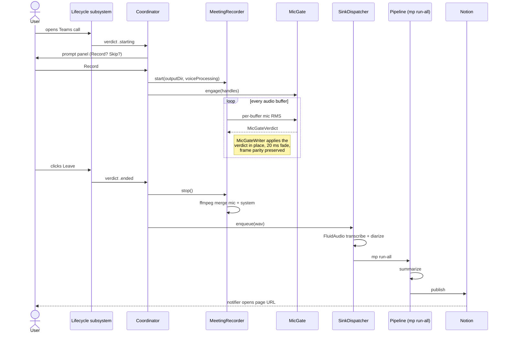
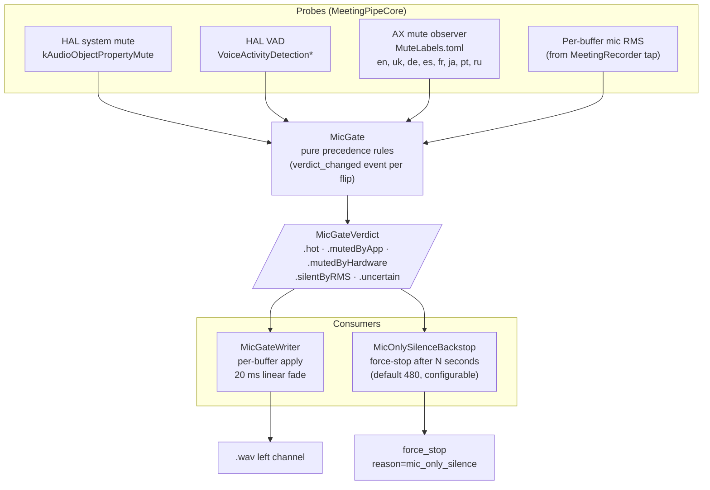
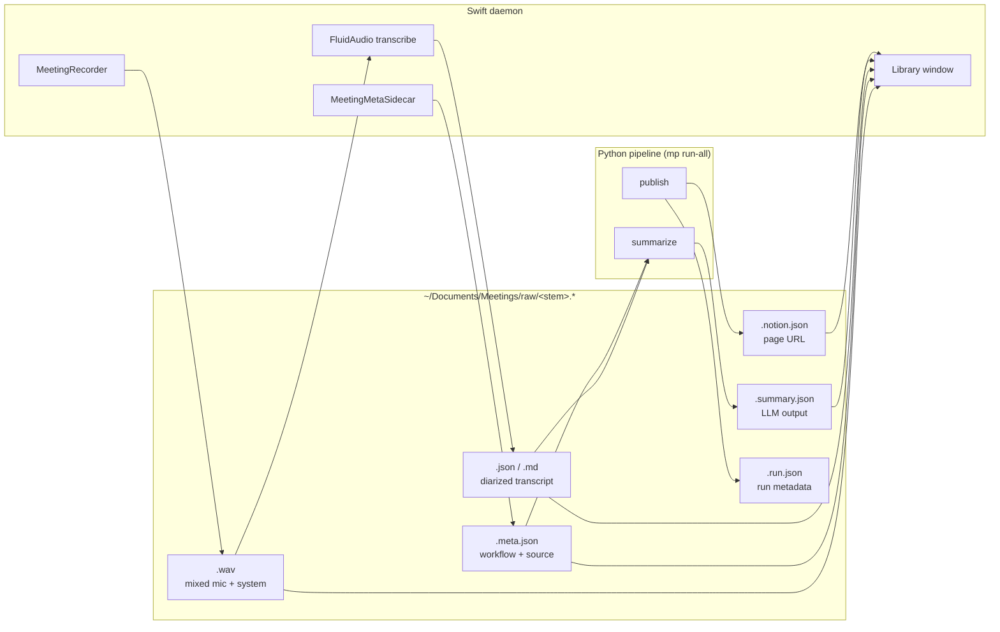
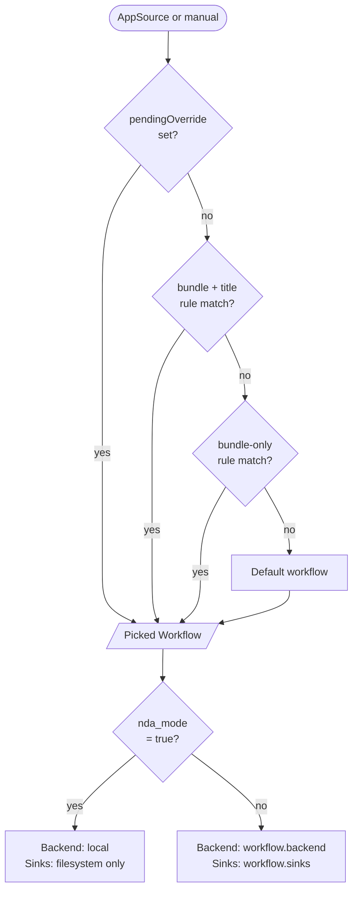

# Architecture

Fast subsystem map for finding code. For the *why* behind shape decisions, see [`SPEC.md`](./SPEC.md). For terminology, see [`GLOSSARY.md`](./GLOSSARY.md). For coding patterns, see [`CONVENTIONS.md`](./CONVENTIONS.md).

```
meeting-pipe/
├── daemon/      Swift menu-bar app (detection, recording, transcription, UI, hotkeys)
├── pipeline/    Python CLI invoked as `mp <subcommand>` (summarize, publish)
└── scripts/    install.sh, rebuild.sh, uninstall.sh, dev tools
```

The daemon records the WAV, writes the `.meta.json` sidecar, and transcribes on-device (FluidAudio); then it spawns the pipeline as a subprocess and forgets about it. The pipeline reads the transcript and the sidecar, decides what to do per workflow, and summarizes / publishes. The two processes share contracts via files on disk: `.meta.json` (per recording) and `events.jsonl` / `pipeline_events.jsonl` (append-only logs).

---

## Visual overview

Five diagrams for the high-level picture. Each answers one question; jump to the section that matches what you need.

### Subsystem map

Who-talks-to-whom across the whole system. The daemon is one Swift process that owns detection, recording, and routing; the pipeline is a short-lived Python subprocess invoked per meeting.


### Meeting lifecycle

What happens between "you join a Teams call" and "the Notion page appears". MicGate runs in parallel with the recorder for the whole call; the pipeline subprocess runs after the recorder closes the WAV.



### Verdict-fusion stack

The post-detection layer that decides, every audio buffer, whether your mic should be audible or silent. Four probes feed `MicGate`; its verdict drives both the writer (shapes the recorded audio) and the silence backstop (auto-stops dead meetings).



`MeetingLifecycleCoordinator` is the sibling system for meeting-level verdicts (`.idle`, `.starting`, `.inMeeting`, `.endingProvisional`, `.ended`). It runs alongside MicGate; its `.ended` verdict drives stop-recording (TECH-C13 step 5, shipped).

### Data contracts

The daemon and pipeline share state through files on disk, not IPC. Five sidecars per meeting; the schemas live in [`CONVENTIONS.md`](./CONVENTIONS.md). The library window also reads the same files.



### Workflow resolution

How a recording gets routed: precedence top-down. The prompt window's chevron menu sets an explicit override; failing that, rules match by bundle ID and window title; failing that, the default workflow runs. `nda_mode` then forces local backend + filesystem-only sinks regardless of the resolved workflow's preferences.



---

## Daemon — `daemon/Sources/MeetingPipe/`

### Lifecycle entry points

- `App.swift` — `@main`. NSApplication accessory app. Reads `UISettings`, applies theme, sets up `ConfigStore` + `SecretsStore`, constructs `Coordinator`, wires `StatusBarController`, kicks off `SystemAudioCapture.prewarm`.
- `Coordinator.swift` — the spine. Owns the `AppState` machine (`State.swift`), drives every transition, dispatches between subsystems. ~1500 lines, the only place where everything meets.

### Detection - "is the user in a meeting?"

Detection is the `MeetingPipeCore` lifecycle subsystem plus the daemon-side discovery scan.

- `MeetingPipeCore/Lifecycle/MeetingLifecycleCoordinator.swift` - owns the per-app adapters and fuses their signals into a `MeetingLifecycleVerdict` stream (`.idle`, `.starting`, `.inMeeting`, `.endingProvisional`, `.ended`).
- `MeetingPipeCore/Lifecycle/PromotionEngine.swift` - the pure verdict-fusion rules: a debounce that promotes provisional signals to a confirmed verdict.
- `MeetingPipeCore/Lifecycle/Signals/` - the signal sources: per-process audio activity, ScreenCaptureKit shareable-content windows, the AX Leave button, plus corroborating window-title / workspace / input-device signals.
- `MeetingPipeCore/Lifecycle/Adapters/` - one adapter per meeting client (Teams, Zoom, Webex, Slack, browser), wiring the right signals with locale-tolerant title patterns.
- `MeetingDiscoveryWatcher.swift` / `MeetingSourceScanner.swift` / `MeetingSourceScorer.swift` - start-side discovery: enumerate every concurrent candidate app, score each on "I am in a meeting" evidence, pick the strongest.
- `Resources/meeting_apps.toml` - per-bundle-id table of known meeting apps and their window-title regex hints.
- `SilenceDetector.swift` - pure logic over mic + system RMS samples: decides when to fire the "Still meeting?" notify and the silence auto-stop.
- `RepromptCooldown.swift` - per-bundle suppression window after a recording / skip so a post-call mic flicker can't spawn a fresh prompt.

### Recording - "capture what's playing + what I say"

- `MeetingRecorder.swift` - AVAudioEngine for mic capture + the `SystemAudioCapture` source for everything else, mixed and written to disk. `MicGateWriter` applies the per-buffer mute verdict in place.
- `SystemAudioCapture.swift` - ScreenCaptureKit + ProcessTap (macOS 14.2+) capture of every-other-process audio. The `excludesCurrentProcessAudio` API is the macOS 14 hard floor.

### Mute gating - "don't record me while I'm muted"

- `MeetingPipeCore/MicGate/` - the `MicGate` verdict-fusion subsystem. Probes (HAL system mute, HAL voice-activity detection, an AX read of the meeting client's Mute button, a per-buffer RMS gate) feed `MicGate.decide`; `MicGateWriter` zeros the mic channel with a short fade while muted, preserving frame alignment with system audio.
- `MeetingPipeCore/MicGate/MicOnlySilenceBackstop.swift` - force-stops a recording that has been mic-only and silent past a configured window.

### Transcription - "ASR + speaker labels, on device"

- `Transcription/FluidAudioRunner.swift` - FluidAudio (Parakeet TDT for ASR, pyannote-community-1 for diarization) on the Apple Neural Engine. `SinkDispatcher` runs it after the recorder closes the WAV, producing `<stem>.json` / `<stem>.md`.
- `Transcription/SegmentBuilder.swift`, `TranscriptionRunner.swift`, `TranscriptionService.swift` - segment assembly, the runner protocol, and the factory the dispatcher calls.

### Workflows — per-context routing (TECH-B)

- `Workflow.swift` — the codable struct (matching rules, sinks, backend, NDA flag).
- `WorkflowStore.swift` — TOML CRUD against `~/.config/meeting-pipe/workflows/*.toml`. One file per workflow, atomic writes.
- `WorkflowMatcher.swift` — given an `AppSource`, picks the matching workflow. Precedence: explicit override > bundle id > window title regex > default.
- `WorkflowMigrator.swift` — first-run shim that seeds a "General" workflow from the legacy `summarization.team_context` field.
- `WorkflowInspector.swift` — the prompt-window chip + drop-down that lets the user override before recording.
- `WorkflowsView.swift` — the Workflows tab UI (list, reorder, inline editor, sink picker).
- `MeetingMetaSidecar.swift` — builder for `<stem>.meta.json`. The contract surface between Swift and Python — the pipeline reads exactly these keys via `mp.workflow.apply_overrides`.

### UI surfaces

- **Menu bar:** `StatusBarController.swift` — title, icons (outline/filled per `UISettings.menuBarIconStyle`), lock glyph for regulated mode, model-download progress, aggregate permission warning.
- **Prompt panel:** `MeetingPromptWindow.swift` — the top-right "Record / Skip / Record (BYO)" panel that pops on detection.
- **HUD:** `RecordingHUDWindow.swift` — the floating pulse while recording.
- **Library window:** `LibraryWindow.swift` + `LibrarySidebar.swift` + `LibraryListView.swift` + `MeetingDetailView.swift` + tabs (`TranscriptTab`, `AudioTab`, `CorrectionsTab`, `RawFilesTab`). Reads `~/Documents/Meetings/raw/*.meta.json` via `MeetingStore.swift`. Filter / search via `MeetingFilter.swift`.
- **Preferences:** `PreferencesWindow.swift` (NSWindow shell) + `Preferences/PreferencesView.swift` (SwiftUI NavigationSplitView) + `Preferences/PreferencesControls.swift` (shared primitives: `SettingsGroup`, `SettingsRow`, `SettingsSegmented`, `SettingsHotkeyField`, …).
- **Correction window:** `CorrectionWindow.swift` + `CorrectionEditor.swift` — inline edit of a generated summary, writes a correction record, optional republish.

### Storage / persistence

- `Config.swift` — read-only Config snapshot loaded at launch (`~/.config/meeting-pipe/config.toml`).
- `ConfigStore.swift` — `ObservableObject` wrapper for the same file. Round-trips through TOMLKit, preserves unknown keys (so pipeline-side fields like `transcription.model` survive UI edits). 500 ms debounced writes.
- `Preferences/UISettings.swift` — singleton over `UserDefaults` for cosmetic flags (theme, menu-bar icon style, regulated badge, verbose logging).
- `SecretsStore.swift` — `~/.config/meeting-pipe/secrets.env` (mode 0600), Anthropic + Notion tokens.
- `ConsentStore.swift` — per-bundle "always record this app" decisions.
- `CorrectionStore.swift` — `<stem>.correction.json` records so the user's edits feed back into evals.
- `MeetingStore.swift` — read-only catalog of `<stem>.meta.json` sidecars; powers the Library list. Watches the directory via `DispatchSource.makeFileSystemObjectSource`.

### Plumbing

- `PipelineLauncher.swift` — spawns `mp run-all <wav>` as a subprocess. Each job is one `ProcessingJob` (see `State.swift`); the queue runs them serially so two whisper invocations don't thrash the GPU.
- `PermissionsCenter.swift` — single source of truth for the four TCC permissions (mic, Screen Recording, Accessibility, Notifications). Polls for live-flip detection; publishes a `permissionGranted` PassthroughSubject the Coordinator listens to (so the detector wakes up the moment Accessibility flips on mid-meeting).
- `HotkeyManager.swift` — Carbon RegisterEventHotKey for global hotkeys (toggle + force-stop).
- `Notifier.swift` — UNUserNotificationCenter wrapper (record / skip prompts, "meeting published" alerts).
- `Logger.swift` — `Log.main / .detector / .recorder` os.Logger handles, plus `Log.event(category:action:attributes:)` for the JSONL event log and `Log.writeLine(category:message:)` for the human-readable tail files.
- `ModelDownloadSupervisor.swift` — spawns `mp prefetch-model` for local-backend MLX models; surfaces progress in the menu bar.
- `WindowActivationManager.swift` — keeps the daemon Dock-less when no windows are visible but flips activation policy to `.regular` when the Library or Preferences window is open so Cmd+Tab works.
- `LaunchAtLoginService.swift` — `SMAppService.mainApp` wrapper for the General-tab toggle.

---

## Pipeline — `pipeline/src/mp/`

### Entry point

- `__main__.py` - argv dispatch. Lazy imports per subcommand so `mp --help` and `mp logs` stay fast; the heavier `mlx_lm` / `soundfile` imports are deferred to the subcommands that use them.

### Subcommands (one module each)

| Module | Subcommand | Output |
|---|---|---|
| `orchestrate.py` | `mp run-all <wav>` | reads the daemon transcript, then summarize, then publish; fail-fast |
| `summarize.py` | `mp summarize <transcript.md>` | `<stem>.summary.json`, `<stem>.summary.md` |
| `summarize_local.py` | (called from `summarize`) | on-device MLX path |
| `publish_notion.py` | `mp publish-notion <summary.json>` | Notion page (idempotent) |
| `publish_obsidian.py` | (called via router) | Markdown note in vault |
| `publish_fs.py` | (called via router) | three files in a directory |
| `publish_router.py` | (called from `orchestrate`) | fan-out over `output.sinks` |
| `publish_from_paste.py` | `mp publish-from-paste <transcript.md>` | BYO summary, then publish |
| `workflow.py` | (called from `orchestrate`) | applies `.meta.json` overrides |
| `diarize.py` | (called from `orchestrate`) | channel-aware speaker labels when daemon diarization is missing |
| `doctor.py` | `mp doctor` | preflight diagnostics |
| `logs_cmd.py` | `mp logs` | `events.jsonl` pretty-printer / filter |
| `dogfood.py` | `mp dogfood` | side-by-side backend comparison |
| `prefetch_model.py` | `mp prefetch-model <repo>` | MLX model download (JSONL progress) |
| `corrections.py` | `mp corrections-stats` | aggregate over correction records |
| `analyze_detection.py` | `mp analyze-detection` | meeting-end detection audit |

### Shared services and contracts

- `services.py` — `Protocol`s for the three external dependencies (`SummaryClient`, `Publisher`, `Diarizer`). Concrete implementations live next to use sites; tests inject fakes.
- `schemas.py` — pydantic models. `MeetingSummary` is the JSON contract the publishers expect.
- `config.py` — TOML loader for `~/.config/meeting-pipe/config.toml` + `secrets.env`. Same file the daemon reads.
- `events.py` — Python mirror of Swift's `Log.event`. Appends to `~/Library/Logs/MeetingPipe/pipeline_events.jsonl`.

---

## Data flow

### Detect → record (daemon-only)

```
lifecycle verdict .starting (or discovery scan, or manual hotkey)
  -> WorkflowMatcher.resolve(source) -> Workflow
  -> MeetingPromptWindow shown (or auto-consent / always-for-bundle)
  -> user clicks Record (or auto / timeout-default)
  -> Coordinator.beginRecording(source, summaryMode, workflow)
  -> MeetingRecorder writes <stem>.wav
  -> MeetingMetaSidecar.build writes <stem>.meta.json   (both in ~/Documents/Meetings/raw/)
  -> MicGate engaged for the recording
```

### Stop → process → publish (daemon hands off to pipeline)

```
lifecycle verdict .ended (or hotkey, or silence backstop)
  -> MeetingRecorder.stop -> ffmpeg merge -> final WAV closed
  -> SinkDispatcher: FluidAudio transcribe + diarize -> <stem>.json / <stem>.md
  -> PipelineLauncher.enqueue(ProcessingJob)
  -> mp run-all <wav>:
       orchestrate reads <stem>.meta.json and the daemon transcript
       workflow.apply_overrides -> context_prompt, backend, sinks
       summarize -> Anthropic OR mlx_lm.server (per workflow.backend)
       publish_router fanout -> notion + obsidian + filesystem (per workflow.sinks)
       sidecar updates -> <stem>.run.json, <stem>.notion.json, ...
  -> daemon notifies "published"
```

### Cross-cutting

- **`<stem>.meta.json`** — the only Swift→Python contract surface. Schema lives in `MeetingMetaSidecar.swift` (writer) and `mp.workflow.apply_overrides` (reader). Don't add keys to one without the other.
- **`<stem>.error.json`** is the daemon-internal failure sidecar. Written when a pipeline run fails (transcribe / summarize / launch) with the failed stage and reason; read by the Library to mark the meeting row failed until the owner retries. Cleared on the next successful run. Not a Swift to Python contract: the daemon both writes and reads it.
- **Event log** (`events.jsonl` from Swift + `pipeline_events.jsonl` from Python): one JSON object per line, fields `{ts, category, action, ...attrs}`. Categories Swift writes: `axbus`, `coordinator`, `correction`, `detector`, `doctor`, `halbus`, `library`, `lifecycle`, `main`, `micgate`, `recorder`, `signal`, `transcription`, `workflow`. Categories Python writes: `pipeline`, `publisher`. See [`CONVENTIONS.md`](./CONVENTIONS.md#event-log-schema).
- **Logs directory** (`~/Library/Logs/MeetingPipe/`) — both event logs, plus `daemon.log`, `detector.log`, `recording.log`, `pipeline.log`, `launchd.out.log`, `launchd.err.log`.

---

## Key invariants

- **State machine never reaches two `.recording` states**, and `.stopping` always advances to `.idle` after the WAV closes. `AppState` enum (`State.swift`) is the contract; every transition lives in `Coordinator`.
- **Pipeline runs concurrently with recording.** Processing jobs queue in `Coordinator.processingJobs` and execute serially; the recording state machine is independent of queue depth. A new meeting can start while the last one is still transcribing.
- **Sinks are idempotent and isolated.** `publish_router.fanout` runs each sink; one failing doesn't block the others. Notion uses a deterministic page slug derived from the meeting stem so re-publish is upsert, not duplicate.
- **Unknown TOML keys survive.** `ConfigStore` round-trips through `TOMLTable` and only touches the fields it models. Pipeline-side fields the daemon doesn't know about (`transcription.model`, `summarization.team_context`, …) stay untouched.
- **TCC grants survive rebuilds.** `scripts/install.sh` and `scripts/rebuild.sh` codesign adhoc with a stable `--identifier com.meetingpipe.daemon` and bind Info.plist into the signature. The cdhash still changes per rebuild (no Developer ID), so Screen Recording requires one toggle after rebuild, but Mic + Notifications + Accessibility survive.
- **`Log.event` failures never crash the daemon.** A malformed attribute drops the event silently. Same in `mp.events.emit`.

---

## Where files live on disk (user side)

| Path | Owner | Purpose |
|---|---|---|
| `~/.config/meeting-pipe/config.toml` | both | shared config |
| `~/.config/meeting-pipe/secrets.env` | both | API tokens, mode 0600 |
| `~/.config/meeting-pipe/workflows/*.toml` | daemon writes, pipeline reads | per-workflow definitions |
| `~/Documents/Meetings/raw/<stem>.wav` | daemon writes | recording |
| `~/Documents/Meetings/raw/<stem>.meta.json` | daemon writes, pipeline reads | per-meeting workflow + source |
| `~/Documents/Meetings/raw/<stem>.{json,md,summary.*,correction.json}` | pipeline writes, daemon reads | transcripts / summaries / corrections |
| `~/Library/Logs/MeetingPipe/` | both | tail-able text logs + JSONL event logs |
| `~/Library/LaunchAgents/com.meetingpipe.daemon.plist` | install.sh writes | LaunchAgent |
| `~/Applications/MeetingPipe.app/` | install.sh / rebuild.sh writes | installed bundle |

Memory hygiene note: don't save file paths from this section into Claude memory — read them here when needed. They change.
