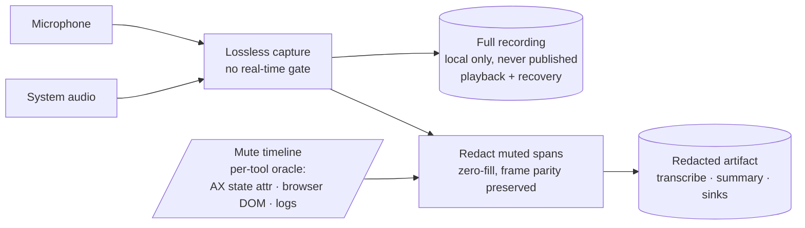

# ADR 0016: Capture-first recording, redact muted spans in post

| Property            | Value                              |
| ------------------- | ---------------------------------- |
| **Status**          | Accepted                           |
| **Date**            | 2026-06-07                         |
| **Decision Makers** | Project owner                      |
| **Technical Area**  | Recording / capture / privacy      |
| **Related Tasks**   | TECH-MIC1 (band: TECH-MIC1..MIC9); amended by TECH-MIC9 (2026-06-08) |
| **Supersedes**      | The mic-gate-at-capture disposition of ADR 0008; the zero-amplitude-at-capture mechanism of ADR 0009 (the frame-parity invariant of 0009 stands) |

## Context

The recurring failure is "I was talking, unmuted, and my mic recorded nothing." A two-auditor review, cross-checked against 19 days of live `events.jsonl` (21,252 micgate events) and the source, then pressure-tested by an adversarial panel, established the cause. The mic gate is fail-closed: `MicGateWriter` writes zero-amplitude frames on any verdict that is not `.hot`, and reaching `.hot` requires a not-muted reading AND voice energy, with no "I am confidently unmuted, so capture" floor. The mute reading comes from one source on macOS, an Accessibility scrape of the meeting app's mute button, and that reading is fragile: it latches a stale `.muted` for a whole call when the cached element dies (Teams re-renders or shows "Mic is not available"), and the rescue meant to clear it never fired in 19 days. When that happens the mic is zeroed in place for the rest of the meeting, and the audio is gone, not recoverable.

A macOS API sweep then confirmed the deeper point both audits only half-stated: there is no general, cross-tool, real-time API to read whether another app's microphone is muted. Core Audio process objects expose "is input running" but no mute property; AUVoiceIO muted-talker detection is first-party only (an app can only see its own mute); ScreenCaptureKit cannot read mute; CallKit only sees calls your own app reports. Accessibility scraping is the only per-app oracle, it is absent for every browser meeting (Google Meet, Teams web, Slack huddles), and it breaks on each vendor UI redesign and locale change. So the architectural root cause is not any single Accessibility bug. It is that a real-time, destructive capture gate depends on a signal that does not exist for most tools and is unstable where it does.

The industry confirms the alternative. Notion AI Meeting Notes and Granola both capture microphone plus system audio at the OS layer and do no per-app mute detection at all. Their cross-tool generality comes precisely from not depending on per-app mute state. Notion stores a temporary local audio copy deleted after processing or within 24 hours (persistent local storage is off by default), and Granola transcribes in real time then deletes the audio immediately and keeps only the transcript. Neither honours in-app mute; both manage privacy by retention, not by gating. meeting-pipe's capture and detection layers are already aligned with this (ScreenCaptureKit system audio plus mic, process-audio plus window detection). Its only divergence is the real-time destructive MicGate, which no competitor has and which is the bug source.

## Decision Drivers

- **No general cross-tool mute signal exists.** A capture gate that depends on one can never be reliable across "most if not all meeting tools," which is the stated product goal.
- **A real-time destructive gate has only two failure modes, and both are bad.** Fail-closed on a wrong reading deletes your real voice (today's bug); fail-open leaks muted audio (the 2026-06-04 revert). With an unreliable oracle you cannot win that trade in real time. The way out is to stop deciding destructively in real time.
- **Privacy stays a first-class value.** meeting-pipe has regulated and NDA modes; "my muted side-comments must not reach the notes" is a real requirement, distinct from the wider industry baseline.
- **Recoverability beats a perfect-but-fragile real-time decision.** If the full audio is kept, a wrong mute reading becomes a recoverable mis-redaction rather than permanent loss, and the decision can be made offline with far more signal than the render thread has.
- **Specialized per-tool oracles are acceptable if they are stable and futureproof against UI/UX changes** (project-owner constraint, 2026-06-07). The localized-label scrape that failed is the counter-example; durable signals (a control's state attribute, platform DOM or extension state, local client logs) are the target.

## Options Considered

### Option 1: Keep the real-time destructive gate, harden the Accessibility oracle

Re-arm the dead element, fix the rescue, broaden the matcher (both audits' lead recommendation). Rejected as the primary architecture: it can make Teams and other native apps more reliable, but it cannot make browser or future tools reliable, because there is no signal there to harden, and any wrong reading still destroys capture. This is demoted to a supporting role (TECH-MIC6) for the one path that still needs a real-time gate.

### Option 2 (chosen): Capture-first, redact muted spans in post

Capture the microphone losslessly, never gated on a real-time mute reading. Record the available mute signal as a timeline rather than applying it destructively. Produce the consumed and published artifact by redacting the muted spans offline. Keep a real-time gate only where no audio at rest is permitted (regulated and NDA). This is the only option that meets the cross-tool goal, because capture no longer depends on a mute oracle.

### Option 3: Capture everything, never redact (the Granola and Notion model)

Simplest and fully tool-agnostic, but it abandons meeting-pipe's privacy posture: muted side-comments would reach the notes. Rejected as the default; retained as an available opt-out for users who want it.

### Option 4: Record everything, mute in post, destructively (no kept original)

Makes the bug impossible but inverts the fail-closed privacy posture and keeps no recovery copy, so a wrong redaction is still permanent. Rejected.

### Sub-decision within Option 2: the default-mode privacy model

The project owner chose, on 2026-06-07, "keep the full recording and redact the muted spans from the notes" over "keep everything, no redaction" and "ephemeral audio, no redaction." It is the most faithful to meeting-pipe's privacy posture while remaining non-destructive: the full recording is kept locally for recovery and playback, and the artifact that is transcribed, summarized, and published is redacted of muted spans. Because the full recording is kept, a redaction driven by a wrong timeline is recoverable, not a loss.

## Decision

Adopt Option 2 (capture-first), with the owner-chosen default privacy model.

1. **Lossless capture is load-bearing and is never gated on a real-time mute reading.** The microphone is captured in full. This alone makes the "recorded nothing" failure impossible, on every tool, with no dependency on any mute oracle.
2. **Default mode keeps the full recording and redacts muted spans from the consumed artifact.** The full recording is retained locally, never published, and used for playback and recovery. The artifact that the transcriber, summarizer, and every sink read is the redacted one, with muted spans removed by zero-filling the mic-channel sample ranges (preserving the ADR 0009 per-channel frame parity, never by removing frames). Redaction runs before any consumer, including the daemon's own on-device transcription.
3. **The mute signal becomes optional metadata: a recorded timeline, not a real-time destructive gate.** The verdict-fusion machinery of ADR 0008 (probes, precedence, per-app adapters) is retained, but its output now feeds the redaction timeline. A real-time gate is kept only for the regulated and NDA path, where no audio at rest is permitted.
4. **Per-tool oracles must use stable, futureproof signals.** The timeline is sourced per client from durable signals (a mute control's state attribute over its localized label for native apps, the platform's own DOM or extension state for browsers, local client logs or SDKs where available), not the localized-title scrape that the incident proved fragile.

Data flow under this decision:

## Consequences

- **The cure (TECH-MIC4) needs no mute oracle.** Stopping the destructive zeroing at capture removes the broken core promise across all tools. The oracle work (MIC6, MIC7, MIC8) then only improves redaction accuracy and serves the regulated gate; it is no longer load-bearing for data loss.
- **The consumed and published artifact is always the redacted one.** Every existing consumer (the daemon's FluidAudio transcription, the Python pipeline, and the sinks) reads the redacted artifact, never the kept full recording. The `diarize.py` channel-aware fallback compares absolute RMS tuned to gated audio, so it in particular must read the redacted artifact or it will mislabel a muted speaker. The kept full recording is local-only and is never a publish candidate.
- **The kept full recording is sensitive at rest and must be handled as such.** It must live where it cannot be enumerated or published by accident: outside the Library-scanned tree and out of the Raw Files tab's reach (that tab lists every stem-prefixed file with one-click Reveal and Open), mode `0600`, excluded from Time Machine and iCloud, with a retention policy and a reaper. If it is exposed as a sibling under the meeting stem, the existing stem-glob and file-listing code will treat it as a normal sidecar, so it needs a distinct location or an explicit deny-list. The amending implementation (MIC4) owns this.
- **A capture mode must be threaded explicitly and fail closed.** Today `MeetingRecorder.start` takes no mode argument and the regulated flag is a mutable global read only when the sidecar is written, after the recording stops. The mode (lossless-plus-redact versus the regulated no-at-rest gate) must be a required argument resolved at `beginRecording`, with no default, so every call site (manual recordings, orphan recovery) chooses, and an ambiguous mode takes the safe path.
- **The regulated and NDA path keeps a residual data-loss risk by design.** Where no audio at rest is permitted, there is no kept recording to recover from, so that path retains a real-time gate and its only reliability lever is hardening the oracle (MIC6). This is an accepted trade for that mode; the default mode does not carry it.
- **Relationship to ADR 0008.** The verdict-fusion architecture stands. What is superseded is the disposition that `MicGateWriter` zeroes the mic at capture as the privacy mechanism. The verdict now drives an offline redaction timeline (and a real-time gate only under regulated and NDA).
- **Relationship to ADR 0009.** The per-channel frame-parity invariant is unchanged and remains load-bearing. It is now enforced at redaction time (zero-fill of sample ranges, never frame removal) instead of at capture time. The stereo-on-disk and mono-on-playback decision is untouched; library playback of the redacted artifact is consistent (muted asides are silent), and an opt-in "play original" can read the kept full recording.
- **Behaviour change, signed off.** By default meeting-pipe no longer drops muted-mic audio destructively at capture; it keeps the full recording and redacts the notes. The project owner approved this default on 2026-06-07. The change ships in TECH-MIC4 (lossless capture) and TECH-MIC5 (the redaction layer); this ADR is the decision gate for that band.

## Amendment 2026-06-08 (TECH-MIC9): offline redaction is opt-in, off by default

**What changed.** The default-mode privacy model in the sub-decision above (lines under "Sub-decision within Option 2") is reversed. The default is now Option 3 (capture everything, never redact); the offline muted-span redaction of Option 2 becomes an explicit per-workflow opt-in (`Workflow.flags.redactMutedSpans`, default false), surfaced in the Workflows editor. The capture mode resolves to a new `.captureFirstRedact` only when a workflow opts in; otherwise the default `.captureFirst` keeps the full mic with no timeline written and nothing redacted. Regulated / NDA still resolve to the real-time `.regulatedGate`. Lossless capture (decision point 1) and the kept-original recovery copy are unchanged.

**Why.** On 2026-06-08 a normal (non-regulated) Teams standup lost the owner's entire spoken turn. Teams shipped a new mini-window call UI; the cached AX mute element detached and the scoped window walk read a **stale "muted"** button confidently for the whole call (it was never *blind*, so the `clearAxMute` blind-recovery rescue never fired). The verdict latched `.mutedByApp`, the mute timeline marked the whole recording muted, and the offline redactor zeroed the entire mic channel. The full recording was recoverable from the kept original, but the consumed transcript and summary silently dropped the speaker, and the loss was invisible until the owner noticed. This is the same class of fragile-per-app-oracle failure this ADR set out to remove; it confirmed that *applying* redaction by default re-introduces the data-loss risk that lossless capture had removed, just one layer downstream. For a single-user personal tool, keeping a muted aside in the notes is a far smaller cost than silently deleting real speech, so redaction should be something the user turns on deliberately, not the default.

**Defence in depth (audio-grounded guard).** Even for opt-in recordings, `MuteRedactor` now refuses a *runaway* redaction: when the muted spans cover at least 85% of the recording AND the mic channel carries sustained energy above a speech floor (-50 dBFS), it withholds redaction, keeps the full mic as the canonical artifact, emits a `mute_redaction_withheld` event, and reaps the timeline. A genuinely all-muted-silent meeting (mic near digital silence) still redacts normally. This makes a confidently-wrong oracle degrade (full audio kept, visibly flagged) instead of destroying the notes, independent of which client's UI broke. Decision point 4 ("per-tool oracles must use stable, futureproof signals") stands and is tracked separately: the Teams mini-window AX path still needs re-locking (TECH-MIC6 follow-up) and the durable UI-independent signal remains TECH-MIC8.
